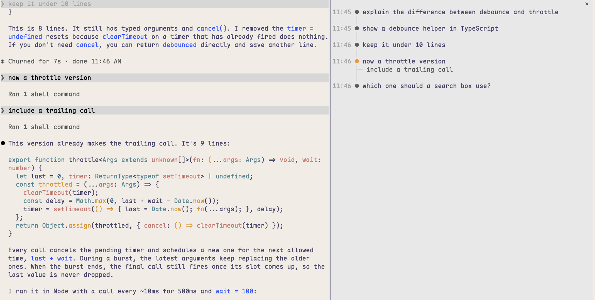

# said

A Claude Code mod: `/said` opens a side panel listing every message you've sent in the session, as a timeline. Press one and the transcript scrolls back to it.



- Each turn is a dot with the time you sent it; a message you sent while Claude was still working branches off its turn (`├─`).
- The accented dot follows the transcript: it marks the message you jumped to or just sent, or the topmost of your messages on screen as you scroll.
- Run `/said` again to close the panel.

## Install

In a Claude Code terminal session:

```
/plugin install said --marketplace hfknight/claude-mod-said
```

Answer `y` to add the marketplace, then press Enter to install at user scope. It's active straight away and in every session after.

## Notes

- Jumping needs Claude Code's fullscreen layout, where Claude Code scrolls the transcript itself. In the normal layout your terminal owns the scrollback.
- Only messages sent after the mod loads are listed; messages from before, or from a `--resume`, aren't.
- The list is per session and isn't saved.

## What it hooks

- `session.start`: registers the `/said` command.
- `command.run`, only for `said`: opens or closes the panel. Other commands aren't seen.
- `session.append`: reads each message you send after Claude Code has stored it, to list it. It doesn't change or block anything.
- `turn.complete`: after you interrupt a turn, reads the conversation's messages to drop one that Esc took back into the prompt. It doesn't change the turn.
- `ui.render` of your messages in the transcript: notes which are on screen, to move the accent. They're drawn unchanged.
- `ui.render` of its own panel: draws the list.

## Develop

`claude plugin validate .` checks the manifest, marketplace and hooks module; `claude plugin test .` runs `tests/`. Run it from this folder with `claude --plugin-dir .`.

## License

MIT
